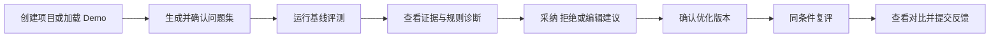

# GEO Insight Studio PRD

## 0. 文档信息

| 字段 | 内容 |
|---|---|
| 功能名 | Explainable GEO Page Optimizer |
| 需求类型 | PRD-ai-native |
| 当前状态 | 已确认，待进入设计 |
| 版本 | 1.0 |
| 关联决策 | `PDR-001`，已通过 GATE-1 |
| 更新时间 | 2026-07-14 |

本期只解决：让 B2B/SaaS 内容与增长人员对一篇单页内容完成“受控问题集评测、可解释诊断、人工选择改写、同条件复评”的闭环。

## 1. 模块定位

本模块把难以解释的“AI 是否会提及或引用我的内容”转成一个可重复操作的单页优化任务，产出基线结果、规则诊断、可编辑改写与 Before/After 报告，为后续真实用户试用和规则迭代提供数据。

## 2. 背景与问题

- 已知事实：竞品已经覆盖监测、提示词追踪与部分内容建议；AutoGEO 论文支持把生成式引擎偏好转成可解释规则和受控改写实验。
- 待验证价值假设：目标用户虽能看到部分结果，但仍难以定位单篇内容为什么表现差、具体应改哪里，并愿意使用可解释诊断完成修改。
- 生成式搜索输出存在随机性，单次结果不能等同于全网排名、真实流量或收入。
- AutoGEO 提供可转译为产品规则的受控诊断思路，但首版不实现其强化学习训练系统。
- 当前关于 ICP、付费意愿和建议采纳意愿仍属于中等置信假设，需由 5-10 位真实试用用户验证。

## 3. 功能目标

### 3.1 用户价值

用户在一次会话中知道：当前内容在哪些受控问题下表现不足、证据在哪里、哪些改法可采纳，以及同条件复评后代理指标是否改善。

### 3.2 AI 职责与人工控制

AI 负责生成候选问题、获取或模拟回答、结构化诊断和提出改写；用户保留问题集确认、建议采纳、手动修改与复评决定权。

### 3.3 首轮成功标准

| 指标 | 目标 |
|---|---:|
| 受邀目标用户 | 5-10 人 |
| 完整有效会话 | >= 5 次 |
| 核心流程完成率 | >= 70% |
| 优化建议采纳率 | >= 30% |
| 系统错误率 | < 5% |
| 真实模型 GEO Rule Score 平均提升 | >= 15% |

Brand Mention 与相对位置只作为探索指标，不承诺提升。

### 3.4 非目标

- 不做多地区、多语言、每日趋势监控。
- 不做全站爬虫、AI crawler analytics 或自动 CMS 发布。
- 不做团队权限、订阅支付、企业集成和复杂任务队列。
- 不实现 AutoGEOMini 强化学习训练。
- 不把代理指标表述为全网排名、流量或收入增长。

## 4. 用户场景

首轮主样本只招募 B2B/SaaS 内容运营、SEO/GEO 负责人；增长负责人和代理人员作为探索样本单独标记，不与主样本合并解释。准入者必须拥有一篇真实待优化内容，并对该内容有修改或建议权。

### 场景 A：内容上线前检查

- 触发：新产品页或文章准备发布，需要检查 AI 回答中的可理解性与被提及机会。
- 当前做法：人工向通用 LLM 零散提问并凭经验改稿，难以保留一致条件。
- 产品任务：粘贴内容，确认问题集，运行评测并处理建议。
- 最终决策：决定是否采用优化版本发布，并保留限制说明。

### 场景 B：既有内容定向优化

- 触发：既有页面需要迭代，但团队不清楚应先修改哪一部分。
- 当前做法：依赖通用润色或监测结果，改动与结果之间缺少证据链。
- 产品任务：输入品牌、受众和最多 3 个竞品，查看规则短板，手动控制改写后复评。
- 最终决策：判断建议是否可用、是否继续该方向，不能把代理提升直接当作流量结论。

### 场景 C：试用反馈

用户完成或中止流程时，提交“是否有用”和原因；系统只记录最小事件数据，用于决定下一轮优先级。

## 5. 核心对象

| 对象 | 产品含义 | 关键规则 |
|---|---|---|
| 单页项目 | 一次真实内容优化任务 | MVP 每次只处理一个页面正文 |
| 问题集 | 目标用户可能向生成式搜索提出的问题 | 用户确认后才进入评测 |
| Evaluation Run | 某一组固定条件下的评测 | 必须标记 Mock 或 Real |
| Answer Evidence | 对回答、品牌和竞品出现情况的可核查记录 | 不可核查引用显示 N/A |
| Rule Diagnosis | 规则维度、原文证据、影响与修复建议 | 诊断必须指向具体内容片段 |
| Recommendation | AI 提出的局部或整体改写建议 | 用户可采纳、拒绝或手改 |
| Content Version | 基线正文或优化后正文 | Before/After 各自可追溯 |
| Comparison | 同条件两次运行的差异 | 条件不同则禁止宣称有效对比 |
| Feedback | 用户对结果或建议的反馈 | 不收集无必要个人信息 |

## 6. 人机双轨协作

| 阶段 | 人工动作 | AI 动作 | 系统反馈 | 边界 |
|---|---|---|---|---|
| 项目配置 | 输入品牌、受众、正文、竞品 | 检查完整性 | 字数、缺失项、模式提示 | 不自动抓取未知网页 |
| 问题准备 | 编辑、删除、确认问题 | 生成并分类候选问题 | 数量、分类、可编辑状态 | 未确认不得评测 |
| 基线评测 | 选择 Mock/Real 并启动 | 生成回答和结构化结果 | 进度、成功数、失败数 | Mock 与真实结果严格区分 |
| 规则诊断 | 查看证据和优先级 | 生成维度得分与建议 | 原文证据、影响、建议 | 不伪造引用或确定性结论 |
| 内容优化 | 采纳、拒绝或手改 | 生成候选改写 | 差异预览、待确认状态 | 用户确认前不覆盖原文 |
| 同条件复评 | 确认优化版本并启动 | 复用相同问题集与条件 | Before/After 与限制说明 | 条件不一致则不计算提升 |
| 反馈 | 评价结果是否有用 | 可生成反馈标签候选 | 提交状态 | 正文不进入分析埋点 |

## 7. 主链路与阶段流转

### 7.1 状态分层

| 层级 | 状态 | 进入条件与允许动作 |
|---|---|---|
| Project Stage | `draft`、`prompt_ready`、`baseline_ready`、`diagnosed`、`optimization_draft`、`optimization_confirmed`、`comparison_ready` | 只描述用户任务阶段；后续路由必须满足前一阶段产物存在 |
| Run Status | `queued`、`running`、`cancel_requested`、`cancelled`、`partial_success`、`success`、`failed` | 只描述一次评测执行；终态不可回退，重试创建新 attempt 并关联来源 Run |
| Optimization Draft | `unchanged`、`editing`、`waiting_confirmation`、`confirmed`、`stale` | 正文或目标片段变化会使相关建议和既有确认失效 |

关键迁移：启动评测后进入 `queued -> running`；取消进入 `cancel_requested` 并禁用重复操作，最终为 `cancelled` 或已先完成的终态。0 条有效回答为 `failed`；至少 1 条但未全部完成为 `partial_success`，可查看带低置信提示的预览诊断，但不可确认优化版本或生成正式对比。完成失败项重试并得到全部有效回答后，才取得正式下游资格。

刷新页面从服务端恢复当前 Stage 与 Run；直接访问后续页面时回到最近可用阶段。修改已确认问题集会使已有基线和对比资格失效；离开未确认编辑前必须提示。

## 8. 页面结构与关键状态

| 页面 | 入口与主要区域 | 用户动作 | 必须覆盖状态 |
|---|---|---|---|
| S01 项目配置 | 首页；品牌、受众、正文、竞品、Demo、项目删除入口 | 创建或删除项目 | default、validation、saving、delete_confirm、deleting、error |
| S02 问题集 | 创建成功后；问题列表与分类 | 编辑、删除、补充、确认 | generating、editable、empty、error |
| S03 基线评测 | 问题确认后；模式、进度、结果摘要 | 启动、取消、重试 | ready、provider_unavailable、running、cancel_requested、cancelled、partial_success、failed、success |
| S04 诊断与优化 | 基线完成后；诊断摘要、建议处理、正文确认三个工作区 | 筛选、采纳、拒绝、撤销、重置、手改、确认版本 | loading、N/A、no_mention、empty_suggestion、editing、waiting_confirmation、confirmed、stale、disabled |
| S05 对比报告 | 优化版本确认后；Before/After、覆盖率、限制与反馈 | 复评、查看详情、反馈 | running、partial_success、invalid_comparison、success、feedback_submitting、feedback_success、error |

正式 UI 阶段必须在 Figma 中以真实文本和组件覆盖以上状态；生成式图片只用于视觉探索和位图素材，不得直接充当运行页面。

S03-S05 顶部固定运行上下文条，持续展示“内容来源：Demo/用户输入”“评测模式：Mock/Real”、Provider、模型别名、问题集版本、有效样本数和置信状态；Rule Score 旁固定显示“代理指标”。中止或退出 S02-S05 时复用可选反馈组件，不新增独立页面。

响应式基准为 1366px 桌面；窄屏转单列，S04 三工作区和 Before/After 使用标签页或抽屉，表格只在自身容器内横向滚动，主操作保持可见。Figma 压力样本至少覆盖 20 个问题、3 个竞品、长证据、长品牌名和 N/A。

## 9. P0 功能需求

### REQ-001 创建单页项目与 Demo

- 输入：项目名、目标品牌、目标用户、正文、0-3 个竞品。
- 处理：校验必填项与正文长度；允许一键载入内置 Demo。
- 输出：可继续生成问题集的项目。
- 验收：非法输入给出字段级错误；Demo 明确标记为示例数据。

### REQ-002 生成、编辑并确认问题集

- 系统默认生成 10 个、最多 20 个问题，并按发现、对比、选择等意图分类。
- 用户可增删改；至少保留 3 个问题才能确认。
- 生成失败时保留人工输入入口，不阻断后续流程。

### REQ-003 选择评测模式

- 支持稳定 Mock 与一个 Real Provider。
- Mock 数据具有独立版本；跨 Mock 版本不得比较。
- Real Provider 使用运营方在服务端配置的凭证，前端不接收、不保存用户 API Key；具体厂商与模型由 ADR 选择。
- 页面持续显示当前模式；服务端配置不可用时禁用 Real，并显示原因和明确切换 Mock 的入口。
- 任何报告均带模式标签，不允许把 Mock 数据表述为真实模型数据。

### REQ-004 完成基线评测

- 使用已确认问题集获取回答，展示总体进度和逐问题状态。
- 支持部分成功；失败项可重试，成功结果不得丢失。
- 用户取消后保留已完成结果，但不能进入正式对比。
- Pilot 的 Real 模式每个问题默认重复 3 次；Mock 重复 1 次。成本上限和超时预算由 ADR 约束，但不得在运行中静默降低重复次数。

### REQ-005 计算可见性结果

- 展示目标品牌提及率、可识别的相对位置和最多 3 个竞品的轻量对比；品牌主名称和用户确认的别名按去空格、忽略英文大小写后匹配。
- P0 的引用指标定义为 Citation Availability：仅接受 Provider 原生返回且包含公开可访问 URL 的来源，不宣称来源语义已核真；否则显示 N/A 和原因。
- 无品牌提及是合法结果 0，不作为系统错误。

### REQ-006 输出可解释规则诊断

- 每条诊断包含规则维度、相关原文、影响等级、解释和最小修复建议。
- 支持按影响等级筛选；无证据的规则不得伪装成确定结论。
- 规则得分是代理指标，报告必须显示限制说明。
- Rule Score 使用第 11.2 节锁定的 `rules-v1`；无具体证据的维度不得获得正分。

### REQ-007 生成人工可控的优化版本

- 每条建议绑定生成时正文版本和目标片段，只逐条作用于当前工作副本；系统即时展示相对基线的修改差异。
- 支持撤销单条和重置工作副本；片段已被手改或重叠建议改变时，旧建议进入 `stale`，禁止自动覆盖，需用户重新确认或重新诊断。
- 未确认前不覆盖基线正文；至少产生一项改动才可建立优化版本。
- AI 输出不可用时允许完全手动编辑。

### REQ-008 同条件复评

- 使用同一问题集、模式和冻结条件评测优化版本；条件指纹包含模式、Provider、模型标识及可用修订版、模型参数、评测提示模板版本、问题集版本与顺序、重复次数、规则版本和 Mock 版本。时间只记录，不参与相等判断。
- 条件不一致时阻止计算提升，并引导重新选择兼容条件。
- 报告展示两次运行的 Provider、模型、问题集版本、时间和重复次数。

### REQ-009 Before/After 报告与反馈

- 展示规则得分、品牌提及、相对位置、引用可用性和逐问题差异。
- 清楚区分提升、下降、无变化与 N/A。
- 用户可提交有用性评分、建议采纳原因或中止原因。

### REQ-010 最小数据控制

- 分析事件不包含页面正文、API Key、完整模型回答或个人身份信息。
- 用户可删除试用项目及其内容；删除结果可观察。
- Pilot 内容默认保留 30 天。删除项目必须在用户看到成功前删除正文、问题集、完整回答、诊断、建议、版本和运行；仅保留无法重新关联项目或用户的聚合事件。

## 10. AI 状态反馈与人工接管

| 状态 | 用户可见反馈 | 可执行动作 |
|---|---|---|
| generating/evaluating | 当前阶段、总数、已完成数 | 取消 |
| waiting_confirmation | AI 结果尚未写入正式版本 | 编辑、确认、放弃 |
| partial_success | 成功/失败数量和失败项 | 重试失败项、继续查看 |
| failed | 原因类别和是否可重试 | 重试、改用 Mock、返回编辑 |
| provider_unavailable | Real 暂不可用 | 修复配置或明确切换 Mock |
| invalid_comparison | 条件不一致项 | 恢复相同条件或放弃对比 |

Real 模式失败时不得静默切换 Mock；只有用户明确确认后才能切换，并生成新的、带 Mock 标签的运行。

## 11. 业务规则与指标口径

### 11.1 漏斗与可见性指标

- 有效价值会话：唯一受邀目标用户使用真实内容和 Real 模式完成基线与诊断，并完成优化版本、或明确中止并提交原因。Demo、Mock、内部测试、重复调试不计入价值会话。
- 核心完成率 = 触发 `comparison_completed` 的有效价值会话 / 创建真实项目并启动 Real 基线的独立会话。报告必须同时展示独立用户数、分子和分母。
- 建议采纳率 = 首次直接采纳或采纳后编辑的建议数 / 首次展示且可操作的建议数；直接采纳、编辑后采纳和拒绝分别报告，该指标只是行为代理。
- 系统错误率 = 系统或 Provider 原因失败的可执行操作 / 总可执行操作；用户取消、输入校验、无凭证和刷新不计入分子，重试按独立 operation 记录。
- Brand Mention Rate = 含目标品牌的有效回答数 / 有效回答数。
- 相对位置仅在回答包含可稳定识别的有序推荐时计算，否则 N/A。
- N/A 原因使用有限类别：`source_unverifiable`、`unordered_answer`、`condition_mismatch`、`insufficient_sample`、`not_supported_by_provider`。

### 11.2 GEO Rule Score `rules-v1`

每个维度按固定量表取 0-4 分：0 无证据或明显不满足，1 弱，2 基本，3 良好，4 充分。总分 = 各维度 `得分 / 4 × 权重` 之和，范围 0-100，四舍五入到 1 位小数。

| 维度 | 权重 | 正分证据要求 |
|---|---:|---|
| 事实准确与来源可信 | 25 | 关键陈述具有可识别来源、定义或可核查限定 |
| 完整但不过度冗长 | 15 | 回答目标所需信息完整且不存在明显重复 |
| 结论先行与逻辑结构 | 15 | 主要结论、层级和因果/步骤关系可定位 |
| 清晰、聚焦与自包含 | 15 | 脱离外部上下文仍能理解，主题不漂移 |
| 中立与必要观点覆盖 | 10 | 不夸大，并说明关键限制或适用边界 |
| 数据、案例、引用或定义支撑 | 20 | 至少一种具体支撑与对应陈述绑定 |

Before/After 必须使用同一规则版本。15% 成功指标定义为有效 Real 完整对比的 `(After - Before) / Before × 100%` 的会话平均值；基线为 0 的会话只报告绝对分差并排除百分比均值。该分数只验证规则闭环，不能单独证明用户价值或真实可见性提升。

### 11.3 Pilot 判定

- 主样本准入：B2B/SaaS 内容运营或 SEO/GEO 负责人，持有真实内容并有修改/建议权；探索角色单独报告。
- 至少 5 位独立目标用户后才执行方向裁决；比例一律带原始分子分母，视为方向性门槛而非市场结论。
- `>=15%` 只基于 Real、条件指纹一致、Before/After 全部问题和全部 3 次重复均有效的完整对比；样本不足时只报告，不判定达标。
- 继续：至少 2/5 目标用户明确认为单页诊断能支持真实改稿决策，且无信任或错误率阻断。
- 调整：用户认可任务但建议不可用、运行波动或关键步骤完成率不足。
- 停止或重新决策：5 位以上目标用户中少于 2 位认可任务；或同条件真实输出仍无法解释；或用户只愿为持续监测付费且不采纳修复建议。

## 12. 异常与边界

- 输入约束：项目名 1-80 字，品牌 1-80 字，目标用户 1-200 字，正文 100-20,000 字，竞品 0-3 个且去空格后不重复；问题 3-20 个，每个 5-300 字且去空格后不重复。纯空白视为空。
- 正文或字段不满足约束：阻止创建并给出字段级错误。
- Provider 超时：标记失败或部分成功，允许只重试失败问题。
- Provider 错误分为配置不可用、凭证/额度、限流、超时、网络、模型拒绝、解析失败和未知。限流、超时、网络可重试；凭证/额度与配置错误不自动重试。
- 模型返回无法解析：显示该问题失败，不编造结构化结果。
- 只有部分回答成功：至少 1 条有效回答时允许预览诊断并显示覆盖率；0 条为失败。完成全部失败项重试前，优化确认、正式复评和 KPI 均禁用或 N/A。
- Citation 无法核查：显示 N/A，不生成虚假 URL。
- 用户改动问题集或模型条件：基线失效，需重跑后才能比较。
- 无建议被采纳：允许退出并反馈，不创建虚假的优化版本。
- 删除项目：后续访问显示不存在，事件中只保留匿名聚合数据。

## 13. 数据闭环

- 用户确认后的问题集、建议决策和内容版本服务于本项目内复评。
- 用户反馈只用于下一轮规则和产品优先级，不自动改变当前运行结果。
- 正文、API Key、完整回答不进入分析埋点或跨用户记忆。
- Pilot 结束后依据完成率、采纳率、错误率、Rule Score 提升和访谈反馈决定进入 N 期、调整规则或停止方向。
- 统一访谈判定问题：“这份诊断是否帮助你决定了具体改哪一处内容？若没有这个工具，你是否仍会用其他方式完成同一任务？”只有回答能指出真实决策或改动，才计为认可。

## 14. P1 与 N

P1：多项目历史、第二 Provider、URL 抓取与引用增强、CSV/PDF/分享、基于试用数据形成调权假设并经独立验证后发布新规则版本。

N：持续多平台监测、全站分析、团队与付费、自动发布、企业集成、RL 训练。

## 15. 整体验收标准

| AC ID | Given / When / Then | 观察证据 |
|---|---|---|
| AC-REQ-001-01 | Given 合法真实输入或 Demo，When 创建项目，Then 进入 S02；非法字段保持 S01 并定位错误 | 页面截图、项目记录、`project_created` |
| AC-REQ-002-01 | Given 已创建项目，When 生成并编辑问题，Then 3-20 个唯一问题可确认；生成失败仍可人工输入 | UI 状态、Prompt Set 版本、事件 |
| AC-REQ-003-01 | Given 服务端 Real 不可用，When 打开模式选择，Then Real 禁用且原因可见；任何 Real 失败不静默转 Mock | 配置夹具、页面截图、Run 模式 |
| AC-REQ-004-01 | Given 已确认问题集，When 运行、取消或重试，Then Run 状态合法、成功项保留且重复操作不重复计数 | Run/attempt 记录、测试日志、事件 |
| AC-REQ-005-01 | Given 固定正反例回答，When 计算指标，Then 0、有效值和 N/A 原因稳定可重算 | 单元测试夹具、结果报告 |
| AC-REQ-006-01 | Given 固定正文，When 应用 `rules-v1`，Then 每条诊断含维度、证据、影响、修复且总分符合公式 | 评分单测、诊断截图 |
| AC-REQ-007-01 | Given 已有诊断，When 采纳、手改、撤销或制造片段冲突，Then 只改工作副本，冲突建议变 stale，确认前不覆盖基线 | Diff 截图、版本记录、事件 |
| AC-REQ-008-01 | Given 两次 Run，When 条件指纹只有正文不同且全部样本有效，Then 生成正式对比；任一条件不同或部分成功则 KPI 为 N/A | 指纹断言、Comparison、报告 |
| AC-REQ-009-01 | Given 正式对比或中止，When 提交反馈，Then 成功可见、失败可重试且同 operation 不重复记录 | 反馈记录、事件查询、页面截图 |
| AC-REQ-010-01 | Given 已有完整项目数据，When 确认删除，Then 内容及派生对象不可读取，保留事件不可关联项目或用户 | 删除测试、脱敏审计日志 |

此外必须满足：Mock 固定夹具用于确定性回归；Real 测试只断言结构、状态、证据关联与安全边界，内容主观质量由目标用户量表验收；所有 P0 均映射到 Figma、组件、服务能力、测试和事件；日志不包含密钥、正文、完整回答或个人身份信息。

## 16. 待确认事项

- 首个 Real Provider、具体模型、超时和成本上限由技术 ADR 选择；产品行为已锁定为单 Provider、服务端凭证、每问题 3 次重复和透明标记。
- Figma file key、正式视觉方向和组件 node id 在设计阶段产生，不阻断 PRD 进入设计。

## 17. 本地草稿附录

- GATE-1 决策：`agent-runs/20260714-0001-discovery-geo-mvp/decisions.md`
- 后续设计承接：正式 PRD 批准后进入 Screen Inventory、状态模型和 Figma 设计。
- 本文不包含具体接口字段或数据表；这些在技术 ADR 与开发计划阶段补充。
