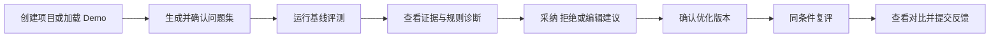

# GEO Insight Studio PRD V0

## 0. 文档信息

| 字段 | 内容 |
|---|---|
| 功能名 | Explainable GEO Page Optimizer |
| 需求类型 | PRD-ai-native |
| 当前状态 | 讨论中 |
| 版本 | 0.1 |
| 关联决策 | `PDR-001`，已通过 GATE-1 |
| 更新时间 | 2026-07-14 |

本期只解决：让 B2B/SaaS 内容与增长人员对一篇单页内容完成“受控问题集评测、可解释诊断、人工选择改写、同条件复评”的闭环。

## 1. 模块定位

本模块把难以解释的“AI 是否会提及或引用我的内容”转成一个可重复操作的单页优化任务，产出基线结果、规则诊断、可编辑改写与 Before/After 报告，为后续真实用户试用和规则迭代提供数据。

## 2. 背景与问题

- 目标用户已经能从通用 LLM 或监测类产品看到部分结果，但难以定位单篇内容为什么表现差、具体应改哪里。
- 生成式搜索输出存在随机性，单次结果不能等同于全网排名、真实流量或收入。
- AutoGEO 提供可转译为产品规则的受控诊断思路，但首版不实现其强化学习训练系统。
- 当前关于 ICP、付费意愿和建议采纳意愿仍属于中等置信假设，需由 5-10 位真实试用用户验证。

## 3. 目标、成功标准与非目标

### 3.1 用户价值

用户在一次会话中知道：当前内容在哪些受控问题下表现不足、证据在哪里、哪些改法可采纳，以及同条件复评后代理指标是否改善。

### 3.2 AI 价值

AI 负责生成候选问题、获取或模拟回答、结构化诊断和提出改写；用户保留问题集确认、建议采纳、手动修改与复评决定权。

### 3.3 首轮成功标准

| 指标 | 目标 |
|---|---:|
| 受邀目标用户 | 5-10 人 |
| 完整有效会话 | >= 5 次 |
| 核心流程完成率 | >= 70% |
| 优化建议采纳率 | >= 30% |
| 系统错误率 | < 5% |
| 真实模型 GEO Rule Score 平均提升 | >= 15% |

Brand Mention 与相对位置只作为探索指标，不承诺提升。

### 3.4 非目标

- 不做多地区、多语言、每日趋势监控。
- 不做全站爬虫、AI crawler analytics 或自动 CMS 发布。
- 不做团队权限、订阅支付、企业集成和复杂任务队列。
- 不实现 AutoGEOMini 强化学习训练。
- 不把代理指标表述为全网排名、流量或收入增长。

## 4. 目标用户与关键场景

### 场景 A：内容上线前检查

内容运营粘贴产品页或文章，确认系统生成的问题集，运行评测并选择可接受的内容建议，最终获得同条件对比结果。

### 场景 B：既有内容定向优化

增长负责人输入品牌、目标受众和最多 3 个竞品，查看品牌提及和规则短板，手动编辑 AI 改写后复评。

### 场景 C：试用反馈

用户完成或中止流程时，提交“是否有用”和原因；系统只记录最小事件数据，用于决定下一轮优先级。

## 5. 核心对象

| 对象 | 产品含义 | 关键规则 |
|---|---|---|
| 单页项目 | 一次真实内容优化任务 | MVP 每次只处理一个页面正文 |
| 问题集 | 目标用户可能向生成式搜索提出的问题 | 用户确认后才进入评测 |
| Evaluation Run | 某一组固定条件下的评测 | 必须标记 Mock 或 Real |
| Answer Evidence | 对回答、品牌和竞品出现情况的可核查记录 | 不可核查引用显示 N/A |
| Rule Diagnosis | 规则维度、原文证据、影响与修复建议 | 诊断必须指向具体内容片段 |
| Recommendation | AI 提出的局部或整体改写建议 | 用户可采纳、拒绝或手改 |
| Content Version | 基线正文或优化后正文 | Before/After 各自可追溯 |
| Comparison | 同条件两次运行的差异 | 条件不同则禁止宣称有效对比 |
| Feedback | 用户对结果或建议的反馈 | 不收集无必要个人信息 |

## 6. 人机双轨协作

| 阶段 | 人工动作 | AI 动作 | 系统反馈 | 边界 |
|---|---|---|---|---|
| 项目配置 | 输入品牌、受众、正文、竞品 | 检查完整性 | 字数、缺失项、模式提示 | 不自动抓取未知网页 |
| 问题准备 | 编辑、删除、确认问题 | 生成并分类候选问题 | 数量、分类、可编辑状态 | 未确认不得评测 |
| 基线评测 | 选择 Mock/Real 并启动 | 生成回答和结构化结果 | 进度、成功数、失败数 | Mock 与真实结果严格区分 |
| 规则诊断 | 查看证据和优先级 | 生成维度得分与建议 | 原文证据、影响、建议 | 不伪造引用或确定性结论 |
| 内容优化 | 采纳、拒绝或手改 | 生成候选改写 | 差异预览、待确认状态 | 用户确认前不覆盖原文 |
| 同条件复评 | 确认优化版本并启动 | 复用相同问题集与条件 | Before/After 与限制说明 | 条件不一致则不计算提升 |
| 反馈 | 评价结果是否有用 | 可生成反馈标签候选 | 提交状态 | 正文不进入分析埋点 |

## 7. 主链路与阶段流转

核心状态：`draft -> prompt_ready -> evaluating -> evaluated -> diagnosed -> optimizing -> optimized -> reevaluating -> completed`。评测可进入 `partial_success` 或 `failed`，失败后保留已完成结果并允许重试。

## 8. 页面结构与关键状态

| 页面 | 入口与主要区域 | 用户动作 | 必须覆盖状态 |
|---|---|---|---|
| S01 项目配置 | 首页；品牌、受众、正文、竞品、Demo | 创建项目 | default、validation、saving、error |
| S02 问题集 | 创建成功后；问题列表与分类 | 编辑、删除、补充、确认 | generating、editable、empty、error |
| S03 基线评测 | 问题确认后；模式、进度、结果摘要 | 启动、取消、重试 | ready、running、partial、failed、success |
| S04 诊断与优化 | 基线完成后；得分、证据、建议、正文差异 | 筛选、采纳、拒绝、手改 | loading、N/A、no_mention、editing、disabled |
| S05 对比报告 | 优化版本确认后；Before/After 与限制 | 复评、查看详情、反馈 | running、invalid_comparison、success、error |

正式 UI 阶段必须在 Figma 中以真实文本和组件覆盖以上状态；生成式图片只用于视觉探索和位图素材，不得直接充当运行页面。

## 9. P0 功能需求

### REQ-001 创建单页项目与 Demo

- 输入：项目名、目标品牌、目标用户、正文、0-3 个竞品。
- 处理：校验必填项与正文长度；允许一键载入内置 Demo。
- 输出：可继续生成问题集的项目。
- 验收：非法输入给出字段级错误；Demo 明确标记为示例数据。

### REQ-002 生成、编辑并确认问题集

- 系统默认生成 10 个、最多 20 个问题，并按发现、对比、选择等意图分类。
- 用户可增删改；至少保留 3 个问题才能确认。
- 生成失败时保留人工输入入口，不阻断后续流程。

### REQ-003 选择评测模式

- 支持稳定 Mock 与一个 Real Provider。
- 页面持续显示当前模式；Real 模式必须满足可用凭证和配置。
- 任何报告均带模式标签，不允许把 Mock 数据表述为真实模型数据。

### REQ-004 完成基线评测

- 使用已确认问题集获取回答，展示总体进度和逐问题状态。
- 支持部分成功；失败项可重试，成功结果不得丢失。
- 用户取消后保留已完成结果，但不能进入正式对比。

### REQ-005 计算可见性结果

- 展示目标品牌提及率、可识别的相对位置和最多 3 个竞品的轻量对比。
- 只有存在可核查来源时展示 Citation 指标，否则显示 N/A 和原因。
- 无品牌提及是合法结果 0，不作为系统错误。

### REQ-006 输出可解释规则诊断

- 每条诊断包含规则维度、相关原文、影响等级、解释和最小修复建议。
- 支持按影响等级筛选；无证据的规则不得伪装成确定结论。
- 规则得分是代理指标，报告必须显示限制说明。

### REQ-007 生成人工可控的优化版本

- 用户逐条采纳、拒绝或编辑建议；系统展示修改差异。
- 未确认前不覆盖基线正文；至少产生一项改动才可建立优化版本。
- AI 输出不可用时允许完全手动编辑。

### REQ-008 同条件复评

- 使用同一问题集、模式和运行条件评测优化版本。
- 条件不一致时阻止计算提升，并引导重新选择兼容条件。
- 报告展示两次运行的 Provider、模型、问题集版本、时间和重复次数。

### REQ-009 Before/After 报告与反馈

- 展示规则得分、品牌提及、相对位置、引用可用性和逐问题差异。
- 清楚区分提升、下降、无变化与 N/A。
- 用户可提交有用性评分、建议采纳原因或中止原因。

### REQ-010 最小数据控制

- 分析事件不包含页面正文、API Key、完整模型回答或个人身份信息。
- 用户可删除试用项目及其内容；删除结果可观察。
- Pilot 内容默认保留 30 天，后续由上线 ADR 确认。

## 10. AI 状态反馈与人工接管

| 状态 | 用户可见反馈 | 可执行动作 |
|---|---|---|
| generating/evaluating | 当前阶段、总数、已完成数 | 取消 |
| waiting_confirmation | AI 结果尚未写入正式版本 | 编辑、确认、放弃 |
| partial_success | 成功/失败数量和失败项 | 重试失败项、继续查看 |
| failed | 原因类别和是否可重试 | 重试、改用 Mock、返回编辑 |
| provider_unavailable | Real 暂不可用 | 修复配置或明确切换 Mock |
| invalid_comparison | 条件不一致项 | 恢复相同条件或放弃对比 |

Real 模式失败时不得静默切换 Mock；只有用户明确确认后才能切换，并生成新的、带 Mock 标签的运行。

## 11. 业务规则与指标口径

- 核心完成率 = 触发 `comparison_completed` 的有效会话 / 触发 `project_created` 的有效会话。
- 建议采纳率 = 被采纳建议数 / 展示且可操作的建议数；手动编辑单独统计。
- 系统错误率 = 非用户取消、非法输入或无凭证导致的失败操作数 / 总可执行操作数。
- Brand Mention Rate = 含目标品牌的有效回答数 / 有效回答数。
- 相对位置仅在回答包含可稳定识别的有序推荐时计算，否则 N/A。
- GEO Rule Score 为版本化规则维度的加权结果；Before/After 必须使用同一规则版本。
- 平均提升使用每次有效完整对比的分数差，再跨会话取平均；基线为 0 时只展示绝对分差。

## 12. 异常与边界

- 正文为空、超过 20,000 字或品牌缺失：阻止创建并给出字段级错误。
- Provider 超时：标记失败或部分成功，允许只重试失败问题。
- 模型返回无法解析：显示该问题失败，不编造结构化结果。
- 只有部分回答成功：允许诊断，但报告显示样本数量和低置信提示。
- Citation 无法核查：显示 N/A，不生成虚假 URL。
- 用户改动问题集或模型条件：基线失效，需重跑后才能比较。
- 无建议被采纳：允许退出并反馈，不创建虚假的优化版本。
- 删除项目：后续访问显示不存在，事件中只保留匿名聚合数据。

## 13. 数据闭环

- 用户确认后的问题集、建议决策和内容版本服务于本项目内复评。
- 用户反馈只用于下一轮规则和产品优先级，不自动改变当前运行结果。
- 正文、API Key、完整回答不进入分析埋点或跨用户记忆。
- Pilot 结束后依据完成率、采纳率、错误率、Rule Score 提升和访谈反馈决定进入 N 期、调整规则或停止方向。

## 14. P1 与 N

P1：多项目历史、第二 Provider、URL 抓取与引用增强、CSV/PDF/分享、基于试用数据调权。

N：持续多平台监测、全站分析、团队与付费、自动发布、企业集成、RL 训练。

## 15. 整体验收标准

1. 新用户可从 Demo 或真实正文完成问题确认、基线、诊断、人工改写、同条件复评和反馈。
2. Mock、Real 和代理指标在所有关键页面与报告中可区分。
3. 每个 AI 阶段都有进行中、部分成功、失败、重试和人工接管路径。
4. Before/After 只有在问题集与运行条件一致时成立。
5. 所有 P0 需求能映射到 Figma 状态、前端组件、服务能力、测试用例和事件。
6. 分析日志不包含密钥、正文、完整回答或个人身份信息。

## 16. 待确认事项

- 首个 Real Provider 与具体模型由技术 ADR 选择，PRD 只锁定单 Provider 能力与透明标记。
- Pilot 的 30 天内容保留期需要在上线前由用户确认。
- 正式真实评测的重复次数和成本上限由技术与试用方案共同确定；比较报告必须展示实际重复次数。

## 17. 本地草稿附录

- GATE-1 决策：`agent-runs/20260714-0001-discovery-geo-mvp/decisions.md`
- 后续设计承接：正式 PRD 批准后进入 Screen Inventory、状态模型和 Figma 设计。
- 本文不包含 API、数据表或具体实现 schema；这些在技术 ADR 与开发计划阶段补充。
